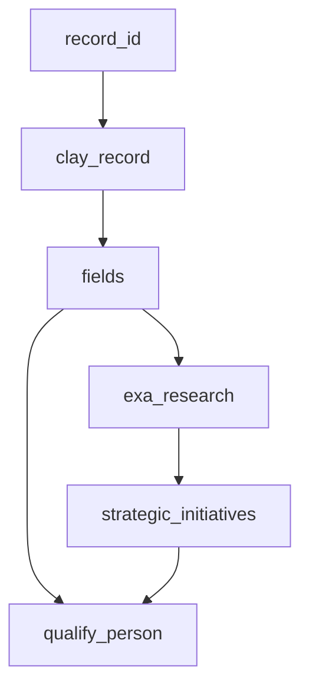

# Clay → Deepline Migration

## Choosing your migration target

| Signal in Clay table | Target | Why |
|---|---|---|
| Batch rows, no triggers, one-time or manual re-runs | **Enrich migration** (this recipe) | `deepline enrich` scripts, run locally |
| Webhook trigger, row routing (`route-row`), CRM writes, campaign pushes | **Cloud workflow migration** → see [cloud-workflow-builder.md](../references/cloud-workflow-builder.md) | `deepline workflows apply`, deployed + event-driven |
| Hybrid: batch enrichment + downstream push to CRM/campaign | **Enrich migration first**, then a **cloud workflow** for the push | Split at the enrichment boundary |

Most Clay tables are enrich migrations. This recipe covers that path end-to-end.

For cloud workflow migrations, **Extraction and Documentation still apply** — then follow [cloud-workflow-builder.md](../references/cloud-workflow-builder.md) with the extracted config as the source artifact.

---

## §1 Extraction

If you need to extract from Clay (no extract JSON provided), read [clay-extraction.md](../references/clay-extraction.md) for MCP and script-based extraction paths, API endpoints, config structure, and input data formats.

If the user already provided an extract JSON or Clay export, skip to §2.

---

## §2 Phase 1: Documentation (Always First)

Produce before writing any scripts. Get user confirmation before Phase 2.

### 2.1 — Table Summary

| # | Column Name | Clay Action | Tool/Model | Output Type | Notes |
|---|---|---|---|---|---|
| 1 | `record_id` | built-in | — | string | |
| … | | | | | |

### 2.2 — Dependency Graph (Mermaid)



Use `classDef` colors: blue = local (`run_javascript`), orange = remote API, green = AI (`deeplineagent`).

### 2.3 — Pass Plan

**Column alias rule:** Derive aliases from the actual Clay column name, snake_cased (e.g. "Work Email" → `work_email`). The two structural aliases `clay_record` and `fields` are fixed — all others follow the Clay schema. Do NOT invent names from a memorized list.

```markdown
| Pass | Column alias     | Deepline tool                 | Depends on     | Notes                                        |
| ---- | ---------------- | ----------------------------- | -------------- | -------------------------------------------- |
| 1    | clay_record      | run_javascript (fetch)        | record_id      | Cookie from env; alias is always clay_record |
| 2    | fields           | run_javascript (flatten)      | clay_record    | alias is always fields                       |
| N    | <clay_col_snake> | <see clay-action-mappings.md> | <prior passes> | Alias = snake_case(Clay column name)         |
```

### 2.4 — Assumptions Log

State every unverifiable assumption. Get confirmation before Phase 2.

### 2.5 — Prompt Extraction

**Do this before writing any prompt approximations.** Actual Clay prompt templates live in formula field cell values or in `typeSettings.inputsBinding`.

**Prompt recovery priority (richest to weakest):**

1. **HAR** — bulk-fetch-records cell values rendered formula prompts verbatim. Use directly.
2. **clay-extract.py output** — `fields[].typeSettings.inputsBinding[name=prompt].formulaText` has the full prompt. Mark as `# RECOVERED FROM EXTRACT — field f_xxx`.
3. **ClayMate `portableSchema`** — `columns[].typeSettings.inputsBinding[name=prompt].formulaText`. Mark as `# RECOVERED FROM PORTABLE SCHEMA — field f_xxx`.
4. **Approximated** — reverse-engineer from outputs or user description. Mark as `# APPROXIMATED — could not recover`.

**JSON schema recovery from portableSchema:**

```python
import json
for col in d['portableSchema']['columns']:
    if col['type'] == 'action':
        for inp in col['typeSettings'].get('inputsBinding', []):
            if inp['name'] == 'answerSchemaType':
                schema_raw = inp.get('formulaMap', {}).get('jsonSchema', '').strip('"')
                schema_raw = schema_raw.replace('\\"', '"').replace('\\n', '\n').replace('\\\\', '\\')
                schema = json.loads(schema_raw)
```

**Fix Clay formula bugs in recovered prompts:** `{{@Name}}` → `{{name}}`, `{single_brace}` → not interpolated by Deepline, `Clay.formatForAIPrompt(...)` → strip wrapper.

### 2.6 — Pipeline Architecture Verification

Check actual cell values across 3+ records before counting AI passes:

| Cell value | Meaning | How to replicate |
|---|---|---|
| `NO_CELL` | Action never fired | Build from scratch |
| `"Status Code: 200"` / `{"status":200}` | HTTP/webhook action — NOT AI | `run_javascript` fetch or stub |
| `""` (empty string) | Disabled or unfired | Treat as NO_CELL |
| Varied generation-shaped text | Actual AI output | `deeplineagent` |

---

## §3 Phase 2: Pre-flight + Script Generation

### Pre-flight Checklist

Answer these **before writing scripts** based on what Phase 1 revealed. Only answer questions that apply.

**Table type (check all that apply):**

- [ ] Has person enrichment columns → verify with `deepline tools search "person enrichment linkedin"`
- [ ] Has email finding columns → use `name_and_domain_to_email_waterfall` as primary play
- [ ] Has AI generation columns (use-ai, claygent, octave) → recover prompts verbatim (§2.5)
- [ ] Has scoring/qualification columns → use ICP criteria verbatim from Clay config
- [ ] Has campaign push / CRM update columns → verify with `deepline tools search "<platform> add leads"`
- [ ] Has cross-table lookups → export linked table to CSV first
- [ ] **Is a company intelligence table** (source = Mixrank) → use `apollo_company_search`

**Security (all tables):**

- [ ] `CLAY_COOKIE` in `.env.deepline` (not hardcoded), single quotes, `.gitignore`d
- [ ] `output/` in `.gitignore`
- [ ] All `run_javascript` fetch calls use `process.env.CLAY_COOKIE`

### Output Files

```
project/
├── .env.deepline             # Clay credentials (never commit)
├── .env.deepline.example     # Template — safe to commit
├── .gitignore                # Excludes .env.deepline, *.csv, output/
├── prompts/
│   └── <name>.txt            # One file per AI column with source header
├── scripts/
│   ├── fetch_<table>.sh      # Fetches Clay records → seed_<table>.csv
│   └── enrich_<table>.sh     # Runs deepline enrich passes → output_<table>.csv
```

### Cookie Pattern (mandatory)

```bash
set -a; source .env.deepline; set +a
: "${CLAY_COOKIE:?CLAY_COOKIE must be set in .env.deepline}"
CLAY_VERSION="${CLAY_VERSION:-v20260311_192407Z_5025845142}"

clay_curl() {
  curl -s --fail \
    -b "${CLAY_COOKIE}" \
    -H "accept: application/json, text/plain, */*" \
    -H "origin: https://app.clay.com" \
    -H "referer: https://app.clay.com/" \
    -H "x-clay-frontend-version: ${CLAY_VERSION}" \
    -H "user-agent: Mozilla/5.0 (Macintosh; Intel Mac OS X 10_15_7) AppleWebKit/537.36 (KHTML, like Gecko) Chrome/145.0.0.0 Safari/537.36" \
    "$@"
}
```

**Never hardcode `CLAY_COOKIE` in scripts.** Use single quotes in `.env.deepline` (GA cookies contain `$`).

**How to get the cookie:** Copy a `curl` from Chrome DevTools (right-click any api.clay.com request → Copy as cURL). Extract the `-b '...'` value.

### Clay API Endpoints

| What you need | Correct endpoint | Notes |
|---|---|---|
| All record IDs | `GET /v3/tables/{TABLE_ID}/views/{VIEW_ID}/records/ids` | View ID required — without it returns `NotFound` |
| View ID | `GET /v3/tables/{TABLE_ID}` → `.table.firstViewId` | Always fetch dynamically |
| Fetch records | `POST /v3/tables/{TABLE_ID}/bulk-fetch-records` | Body: `{"recordIds": [...], "includeExternalContentFieldIds": []}` |
| Response format | `{"results": [{id, cells, ...}]}` | Key is `results`; record ID is `.id` (not `.recordId`) |

### Execution Ordering

The `--with` flag only **declares** a column's schema. The column value is empty until executed via `--execute_cells`.

**Staged pattern:**

```
Stage 1:  Declare all independent columns (--output)
Stage 2:  Execute run_javascript columns first — local, free, fast
Stage 3:  Declare validation/AI columns that reference JS output (--in-place)
Stage 4:  Execute paid/API columns + validation columns
Stage 5:  Declare merge column (--in-place)
Stage 6:  Execute merge column
Stage 7:  Export
```

### Column Index Tracking

Indices assigned in declaration order, 0-indexed. Track explicitly in comments:

| Index range | Source |
|---|---|
| 0 … (seed cols - 1) | Seed CSV columns |
| seed_count | First `--with` column |
| last_declared + 1 | First `--in-place` column |

### Waiting Strategy

```bash
MAX_WAIT=900; ELAPSED=0
while [ $ELAPSED -lt $MAX_WAIT ]; do
  sleep 30; ELAPSED=$((ELAPSED + 30))
  EMPTY=$(deepline csv show --csv work.csv --format json --summary | python3 -c "
import json, sys
d = json.load(sys.stdin)
stats = d.get('_metadata', {}).get('__summary', {}).get('columnStats', {})
total_empty = sum(
  int(s.get('non_empty','0/0').split('/')[1].split()[0]) - int(s.get('non_empty','0/0').split('/')[0])
  for col, s in stats.items() if col in {'workemailprimary','validfln','jobfunction'}
)
print(total_empty)" 2>/dev/null || echo "0")
  echo "${ELAPSED}s elapsed, ~${EMPTY} cells remaining"
  [ "$EMPTY" = "0" ] && break
done
```

For `run_javascript`-only columns: `sleep 15` is sufficient.

### Conditional Row Execution

Filter to rows still missing a value before running expensive fallback stages.

**Critical: Filter BEFORE `--in-place` adds fallback columns.** Otherwise the subset CSV has empty fallback columns → duplicate column names → wrong indices.

```
1. filter_missing → MISSING_CSV
2. deepline enrich --in-place (adds schema cols to work.csv)
3. deepline enrich MISSING_CSV → MISSING_WORK (adds same cols fresh)
4. execute on MISSING_WORK
5. merge_back MISSING_WORK → work.csv
```

`--execute_cells --rows` only accepts contiguous ranges. Filter → separate CSV → merge is the workaround.

### Architecture Choice: CLI vs Python SDK

For Claygent-heavy tables, use a **pure Python script** with `deepline tools execute exa_search` + `deeplineagent`. Enables parallel execution with `ThreadPoolExecutor`, full retry/confidence control.

The `deepline enrich` CLI pattern still applies for non-AI passes and simple single-column `deeplineagent` enrichments.

### Python Subprocess for JSON Payloads

```bash
WITH_ARG=$(python3 - <<'PYEOF'
import json
code = "const fn=(row.first_name||'').toLowerCase()..."
print('col_name=run_javascript:' + json.dumps({'code': code}))
PYEOF
)
deepline enrich --input seed.csv --output work.csv --with "$WITH_ARG"
```

Never hand-build JSON with embedded JS in bash strings.

### Common Failure Modes

| Symptom | Cause | Fix |
|---|---|---|
| Validation on empty string | `perm_fln` not executed before `valid_fln` | Execute JS first (Stage 2), then add validation |
| Merge returns null | Merge inputs not executed | Ensure Stage 4 completes before Stage 5 |
| `{{col}}` empty in prompt | Column declared but not executed | Run `--execute_cells` first |
| Wrong column index | `--in-place` shifted indices | Re-count from seed CSV length |
| Fallback CSV has duplicates | `filter_missing` after `--in-place` | Filter BEFORE adding schema cols |

---

## §4 Action Mapping

Full CLI patterns: [clay-action-mappings.md](../references/clay-action-mappings.md). Always verify tool IDs before use.

### Unknown Action Fallback

```bash
deepline tools search "<what the action does>"   # search by intent
deepline tools get <candidate_tool_id>            # inspect candidate
# if nothing found → deeplineagent fallback
```

| You see in Clay | Search query | Likely result |
|---|---|---|
| `enrich-person-with-*` | `"person enrich linkedin"` | `leadmagic_profile_search` |
| `find-email-*` | `"email finder"` | `hunter_email_finder`, `leadmagic_email_finder` |
| `verify-email-*` | `"email verify validate"` | `leadmagic_email_validation` |
| `company-*` | `"company enrich"` | `apollo_enrich_company` |
| `add-to-campaign-*` | `"add leads campaign"` | `instantly_add_to_campaign` |

### Summary Table

| Clay action | Deepline tool |
|---|---|
| Email waterfall + `validate-email` | `name_and_domain_to_email_waterfall` + `perm_fln` + `leadmagic_email_validation` |
| `enrich-person-with-mixrank-v2` | `leadmagic_profile_search` → `crustdata_person_enrichment` |
| `chat-gpt-schema-mapper` | `deeplineagent` with `jsonSchema` |
| `use-ai` (no web) | `deeplineagent` |
| `use-ai` (claygent + web) | Binary search optimizer — see §5 |
| `octave-qualify-person` | `deeplineagent` + `jsonSchema` ICP scorer |
| `add-lead-to-campaign` | `instantly_add_to_campaign` or `smartlead_api_request` |
| `route-row` | **Not replicable.** Produce filtered output CSV per destination. |
| `find-lists-of-companies-with-mixrank-source` | `apollo_company_search` + optional `prospeo_enrich_company` |

---

## §5 Binary Search Optimizer (Claygent Web Research)

Use whenever replicating a `use-ai (claygent + web)` column.

### Pass Structure

```python
# Pass A — parallel, highlights-only (cheap). Include domain in ALL queries.
queries = [
    f'"{co_name}" {domain} 10-K annual report investor relations',
    f'"{co_name}" {domain} new product launches announcements 2024 2025',
    f'"{co_name}" {domain} go-to-market new customer segments 2024 2025',
]

# Pass B — synthesis with confidence gate
schema = { ...fields..., "confidence": "high|medium|low", "missing_angles": [...] }
# confidence == "high": STOP

# Pass C — follow-up exa searches on missing_angles[0:2], text=True
# Pass D — re-synthesize
# Pass E — primary-source deep-read via _extract_primary_source_url(company_domain)
```

Always add `research_confidence` and `research_passes` tracking columns.

### Confidence Calibration (26-row data)

- `high`: 0% — essentially never with Exa
- `medium`: 35% — large public companies, funded startups
- `low`: 65% — but 50% of `low` had specific useful content

`low` ≠ bad output. Use `is_failed_research()` content quality check instead:

```python
FAILURE_MARKERS = ['UNCHANGED', 'UNRESOLVED', 'NO UPDATE', 'SOURCE INVALID',
                   'CRITICAL SOURCE MISMATCH', 'Unable to determine']
```

Expected failure rate: ~15%.

### Known Failure Modes

| Failure | Example | Fix |
|---|---|---|
| Name collision | `onit.com` → wrong company | Quote `co_name`; add domain |
| No indexed source | `ziphq.com` | Fall back to Crunchbase + LinkedIn |
| URL contamination | Deep-read returns wrong company | Use `_extract_primary_source_url(company_domain=domain)` |

### Adapting Search Angles

| Use case | Angle A | Angle B | Angle C |
|---|---|---|---|
| GTM strategy | 10-K / IR | Product launches | New segments |
| Signal detection | Tech stack / jobs | Engineering blog | Conference talks |
| Competitor research | Pricing pages | G2/Capterra reviews | Exec interviews |
| Private company | Crunchbase / funding | Newsroom | Founder blog |

---

## §6 Patterns and Antipatterns

Clay-specific patterns. For general Deepline patterns (email plays, interpolation, deeplineagent, enrich flags), follow `enriching-and-researching.md` from the deepline-gtm.

### Prompt Recovery

**Do this**: Extract from richest source (HAR > extract > portableSchema > approximate). Mark files with source header.

**Not this**: Approximate when the actual prompt was in the export.

### Email Match Rate

| Format | % of Clay emails |
|---|---|
| `fn.ln@domain` | 63% |
| `fln@domain` | 19% |
| `fn@domain` | 3% |
| Provider waterfall only | ~12% |

Use `name_and_domain_to_email_waterfall` as primary play. Accept `valid`, `valid_catch_all`, AND `catch_all` from validation (NOT `unknown`).

### Cookie Security

Always `process.env.CLAY_COOKIE` in JS code. Single quotes in `.env.deepline`. Add `.env.deepline` and `output/` to `.gitignore`.

### run_javascript

Wrap async in IIFE: `return (async () => { ... })()`. Use string concatenation, not template literals (bash parses backticks). Build `--with` payloads via Python subprocess.

### Clay API Calls

Always use `clay_curl` wrapper. Get `VIEW_ID` from `.table.firstViewId`. Parse with `.get('results', [])`. Record ID is `.id` not `.recordId`.

---

## §7 Phase 3: Validation

### Parity Thresholds

Base thresholds (shared with [cloud-workflow-migrations.md](../references/cloud-workflow-migrations.md#parity-thresholds)):

| Field type | Threshold |
|---|---|
| Deterministic (formulas, fetch, scoring) | 100% exact match |
| LLM classification | ≥90% exact match on unambiguous cases |
| LLM generation | Tone and intent match (manual review) |

Clay-specific extensions:

| Field type | Threshold |
|---|---|
| Email (`work_email`) | DL found rate ≥95% of Clay found rate |
| Structured (`deeplineagent` + `jsonSchema`) | All schema fields populated in 100% of rows |
| Web research | `is_failed_research()` False on ≥85% of rows |

### Running the Comparison

```bash
python3 /path/to/skill/scripts/compare.py ground_truth.csv enriched.csv
python3 /path/to/skill/scripts/compare.py ground_truth.csv enriched.csv \
  --map '{"clay_final_email":"work_email","clay_job_function":"job_function"}'
```

### Accuracy Expectations

- **Valid/valid_catch_all**: high confidence (<5% bounce)
- **catch_all**: domain accepts all — best guess. Same limitation as Clay (same ZeroBounce under the hood)
- **unknown**: skip, do not treat as found

### Diagnosing LLM Mismatches

Follow the process from [cloud-workflow-migrations.md](../references/cloud-workflow-migrations.md#diagnosing-llm-parity-mismatches): check prompt parity → check model parity → check true ambiguity (run 3x) → document, don't overfit.

---

## §8 Critical Rules

- **Execution ordering**: `run_javascript` before `--in-place` columns that reference their values
- **Conditional row execution**: filter → enrich subset → merge. Never run expensive columns on rows where a cheaper stage already found the answer
- **Flatten first** (CLI): `fields=run_javascript:{flatten clay_record}` before `{{fields.xxx}}`. Not needed in Python SDK — use `json.loads()` directly
- **2-level max interpolation**: `{{col.field}}` works; `{{col.field.nested}}` fails silently. Flatten first
- **Structured JSON for deeplineagent**: Single invocation per column, all fields in one `jsonSchema`
- **Separate passes for deps**: A column referenced by `{{xxx}}` must be in a prior enrich call
- **Python subprocess for payloads**: `python3 -c "import json; print(...)"`
- **Cookie in env**: Never embed `CLAY_COOKIE` in code — always `process.env.CLAY_COOKIE`
- **Catch-all is valid**: Accept `valid`, `valid_catch_all`, `catch_all`. NOT `unknown`
- **Prompts verbatim**: Use exact text from source — small differences cause systematic drift

---

## §9 Migration Checklist

1. **Extraction (§1)**: Extract Clay table config (or skip if user provides extract)
2. **Phase 1 (§2)**: Table summary, dependency graph, pass plan, prompt extraction, assumptions
3. **Confirm**: Get user approval on assumptions and pass plan
4. **Phase 2 (§3)**: Pre-flight → generate `fetch_<table>.sh` + `enrich_<table>.sh`
5. **Pilot gate**: `--rows 0:0` (structural), then `--rows 0:3` (real APIs)
6. **Full run**: After pilot approval
7. **Phase 3 (§7)**: `compare.py ground_truth.csv enriched.csv` — confirm thresholds pass
8. **Cloud workflow migration** (optional): If table needs triggers/routing → [cloud-workflow-builder.md](../references/cloud-workflow-builder.md)

### Pilot Gate

`run_javascript` needs no pilot. For paid tools, run rows 0:0 first, then 0:3.

```bash
./enrich_<table>.sh          # row 0 only
./enrich_<table>.sh 0:3      # rows 0-3
./enrich_<table>.sh full     # all rows
```
